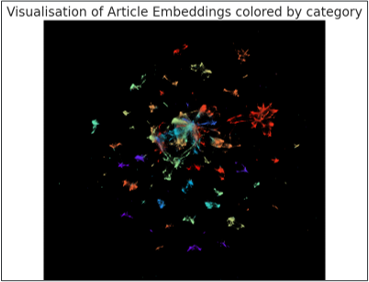

# Creating a Recommendation application

In this project, I design the backend of a mobile application used to recommend
articles to users of a website.

The application is created with the Expo XDE and designed with React.js.

It is connected to a prediction API that I created and deployed with
Azure Functions.

I present 3 types of recommendation models :
- A collaborative filtering model
- A content-based model
- A hybrid model that takes input from both methods

At the end of the project (cf. Notebook), I tried to implement a deep learning model but
failed because of a lack of computing power.

## Useful Links

* [Project presentation (Powerpoint)](Project_Presentation.pptx)
* [Jupyter Notebook](Notebook.ipynb)

## Screenshots

### Hybrid model flowchart

#### Article Embeddings

## Libraries / Packages Used

* [Tensorflow - Keras](https://www.tensorflow.org/)
* [Scikit-Learn](https://scikit-learn.org/)
* [Surprise](https://surpriselib.com/)
* [UMAP-learn](https://umap-learn.readthedocs.io/en/latest/)
* Matplotlib / Seaborn
* Pandas / Numpy 

## Developed By

Octave Antoni

[Connect with me on Linkedin](https://www.linkedin.com/in/octave-antoni/)

## License

    Copyright 2023 Octave Antoni

    Licensed under the Apache License, Version 2.0 (the "License");
    you may not use this file except in compliance with the License.
    You may obtain a copy of the License at

        http://www.apache.org/licenses/LICENSE-2.0

    Unless required by applicable law or agreed to in writing, software
    distributed under the License is distributed on an "AS IS" BASIS,
    WITHOUT WARRANTIES OR CONDITIONS OF ANY KIND, either express or implied.
    See the License for the specific language governing permissions and
    limitations under the License.